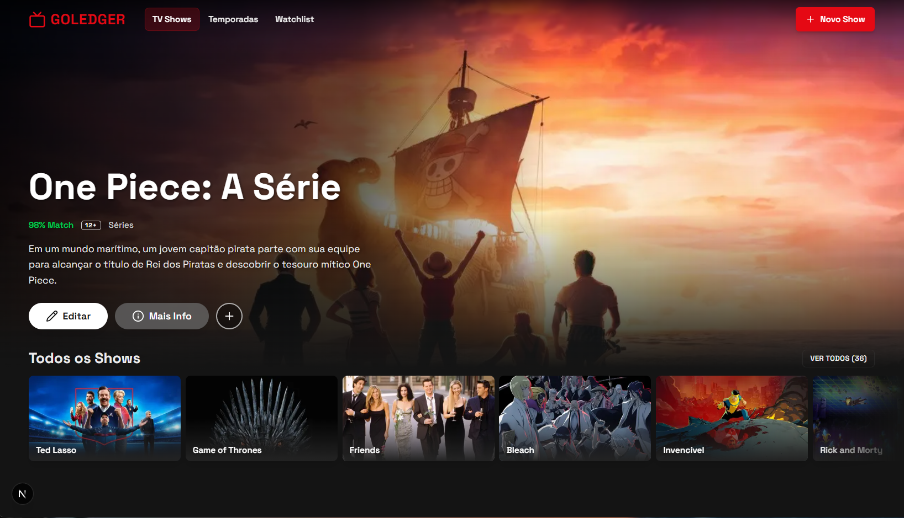
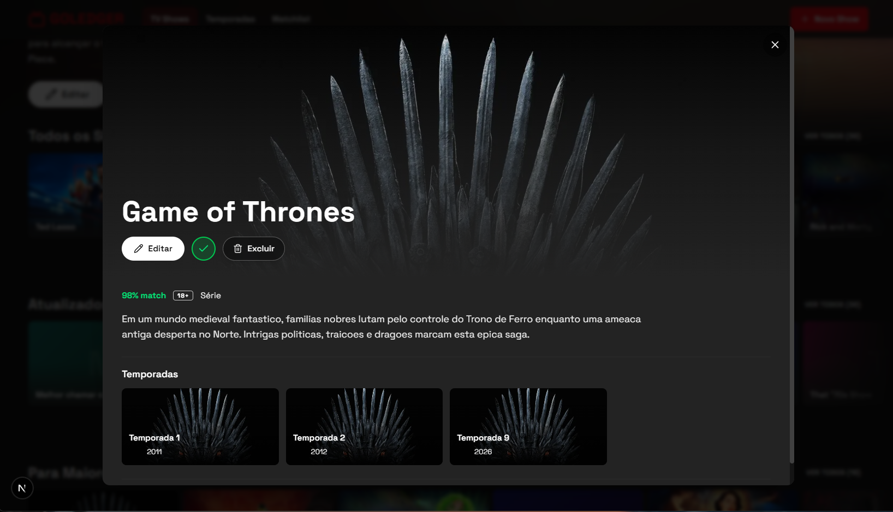
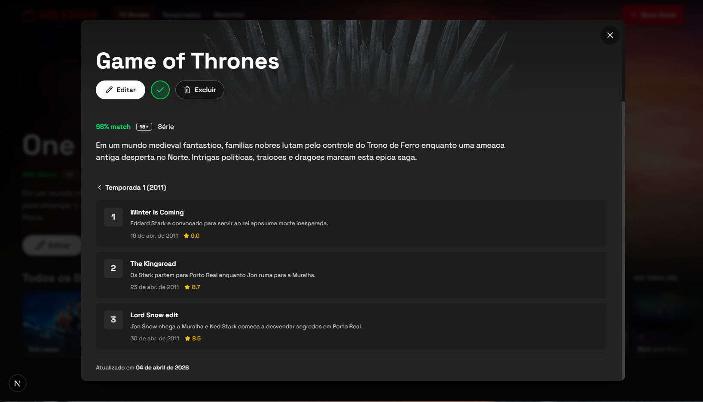
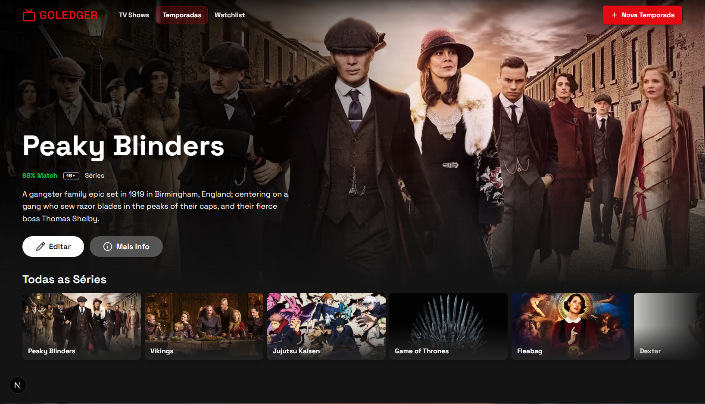
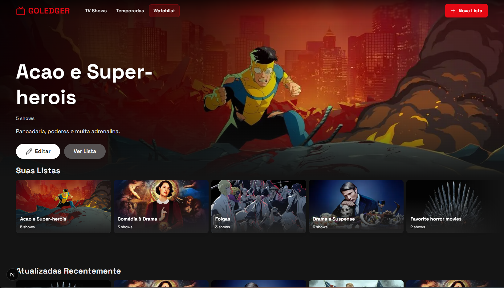
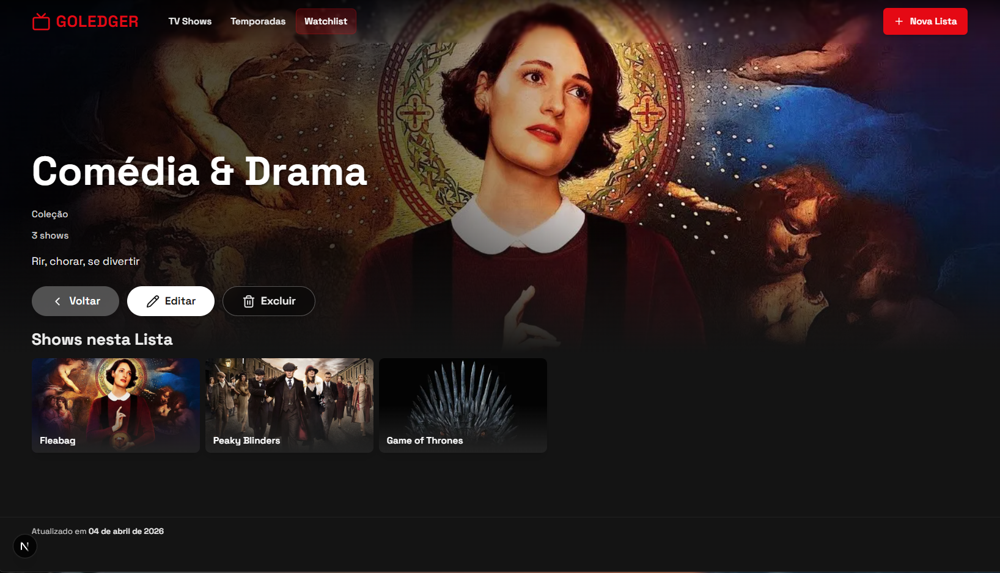

# GoLedger Challenge — Catálogo de TV Shows

> [Read in English](README.md)

Aplicação web para gerenciar TV Shows, Temporadas, Episódios e Watchlists pela API REST blockchain da GoLedger. A interface segue o estilo Netflix com tema escuro, hero banners, carrosséis e hover cards.

**Stack:** Next.js 16 · React 19 · Fastify 5 (BFF) · TailwindCSS 4 · React Query 5 · React Hook Form + Zod · Vitest

## Screenshots

### Home

A página principal exibe um hero banner com imagens backdrop do TMDB e carrosséis horizontais para navegar pelos shows.



### Detalhes do show

Ao clicar em um show, abre um modal com ações de editar/excluir, temporadas e episódios.

| Temporadas | Episódios |
|:---:|:---:|
|  |  |

### Temporadas

Cada show tem sua própria página de temporadas com hero banner e ações de CRUD.



### Watchlist

O usuário cria listas, adiciona shows e navega por coleção.

| Todas as listas | Dentro de uma lista |
|:---:|:---:|
|  |  |

## O que faz

- CRUD para quatro entidades: TV Shows, Temporadas, Episódios, Watchlists
- Camada BFF (Fastify) entre o navegador e a GoLedger — credenciais nunca chegam ao cliente
- Integração com TMDB busca posters e backdrops automaticamente
- Validação de formulários com schemas Zod no cliente e no servidor
- Notificações toast (Sonner) e confetti ao criar registros
- Layout responsivo mobile-first
- 44 testes (Vitest + React Testing Library)

## Como rodar

### 1. Clonar e instalar

```bash
git clone https://github.com/imdouglasoliveira/goledger-challenge-web.git
cd goledger-challenge-web
pnpm install
```

### 2. Variáveis de ambiente

```bash
cp .env.example .env
```

Preencha suas credenciais GoLedger:

```env
GOLEDGER_BASE_URL=http://ec2-50-19-36-138.compute-1.amazonaws.com
GOLEDGER_USERNAME=seu-usuario
GOLEDGER_PASSWORD=sua-senha
```

Para imagens de poster/backdrop, adicione um token TMDB (opcional):

```env
TMDB_ACCESS_TOKEN=seu-token-tmdb
```

### 3. Executar

```bash
pnpm dev
```

Inicia o frontend Next.js (porta 3000) e o BFF Fastify (porta 3001). Abra [http://localhost:3000](http://localhost:3000).

### 4. Build e testes

```bash
pnpm build && pnpm start   # build de produção
pnpm test                   # rodar testes
```

## Estrutura do projeto

```
app/               Páginas Next.js App Router
  ├── page.tsx         TV Shows (home)
  ├── seasons/         Página de temporadas
  ├── episodes/        Página de episódios
  └── watchlist/       Página de watchlist
components/        Componentes React por feature
  ├── layout/          Header, HeroBanner, CarouselRow
  ├── tvshows/         TvShowThumbnail, TvShowForm, TvShowsPage
  ├── seasons/         SeasonCard, SeasonForm, SeasonsPage
  ├── episodes/        EpisodeCard, EpisodeForm, EpisodesPage
  ├── watchlist/       WatchlistCard, WatchlistForm, WatchlistPage
  ├── states/          Loading, Empty, Error states
  └── ui/              Button, Card, Input, Modal, Badge
lib/               Cliente API, hooks, utilitários
src/               Servidor BFF Fastify
  ├── clients/         Cliente da API GoLedger
  ├── routes/          Endpoints REST
  ├── schemas/         Schemas de validação Zod
  ├── services/        Cache de imagens, filtragem de dados
  └── plugins/         CORS, Helmet, Rate Limiting, Swagger
__tests__/         Testes de componentes e API
```

## Arquitetura

O frontend nunca fala com a GoLedger diretamente. Um BFF Fastify cuida de autenticação, rate limiting e enriquecimento de imagens:

```
Navegador → Next.js (:3000) → /api/* rewrite → BFF Fastify (:3001) → API GoLedger
```

## Segurança

- Credenciais da API ficam no servidor — o navegador só fala com o BFF
- Rate limits em mutações: 30/min para criar/atualizar, 10/min para excluir
- Variáveis de ambiente são validadas na inicialização (variável faltando = processo encerra)
